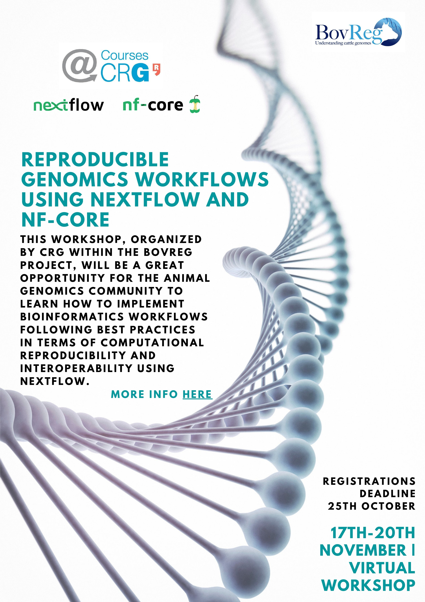

# Reproducible genomics workflows using Nextflow and nf-core

Repository for the BovReg Nextflow workshop organized by the CRG on 17-20 November 2020.

## Programme

The workshop will include a Nextflow training and hackathon, Keynote speakers, and contributed talks selected from participants abstracts. The preliminary event schedule can be found [here](https://sites.google.com/view/reproduciblegenomicsworkflowsu/home).

## Format

Online workshop.

## Interesting links

* Live streams on [BovReg YouTube Channel](https://www.youtube.com/channel/UC0qhdZc9pDT_6dEk3qDUvcA/)
* Use the [BovReg Slack organization](https://join.slack.com/t/bovreg/shared_invite/zt-ior2kx7r-nU04LE3B2RuhTn5ModJJog) for discussion and collaboration.
* Follow us on [Twitter](https://twitter.com/BovReg) and stay tunned during the event and beyond.

**Note:** *If you are a registered participant you should have received the corresponding Zoom links for the different sessions where you have been accepted.*

## Talks

Talks will be streamed on Zoom for registered participants and in [Youtube](https://www.youtube.com/channel/UC0qhdZc9pDT_6dEk3qDUvcA/) for any other person interested. Questions can be posted on Zoom or in the dedicated Slack channel [#workshop-nov-2020-talks](https://bovreg.slack.com/channels/workshop-nov-2020-talks).

* ### Introduction to Nextflow

    **Evan Floden** - Nextflow developer and CEO & Co-founder of [Seqera Labs](https://www.seqera.io/), Spain.

    Watcht it [here](https://youtu.be/EjyMzdoCgjQ?list=PLVWPa8WxHNpQCPsBwMDxUfADe5QkFGF6L).

* ### Introduction to nf-core

    **Phil Ewels** - nf-core core team, Head of Genomics Applications Development at [SciLifeLab](https://www.scilifelab.se/), Sweden.

    Watch it [here](https://youtu.be/-GcuxoIpfOc?list=PLVWPa8WxHNpQCPsBwMDxUfADe5QkFGF6L).

* ### Running nf-core pipelines + Contributing to nf-core (tutorial)

    **Phil Ewels** - nf-core core team, Head of Genomics Applications Development at [SciLifeLab](https://www.scilifelab.se/),
Sweden.

    Watch it [here](https://youtu.be/lUJ1L-qDeXM?list=PLVWPa8WxHNpQCPsBwMDxUfADe5QkFGF6L).

* ### Featured nf-core pipelines

    **Harshil Patel** - nf-core core team, Senior Bioinformatician of  the Bioinformatics and Biostatistics Facility at the
[Francis Crick Institute](https://www.crick.ac.uk/), UK.
    
    Watch it [here](https://youtu.be/hCGuF9bA9ho?list=PLVWPa8WxHNpQCPsBwMDxUfADe5QkFGF6L).

* ### Master of Pores: "A nanopore processing pipeline"

    **Luca Cozzuto** - NGS data analysis Coordinator of CRG Bioinformatics Core  at the
[Centre for Genomic Regulation](https://www.crg.eu/), Spain. 

    Watch it [here](https://youtu.be/fG1PhU6mMxA?list=PLVWPa8WxHNpQCPsBwMDxUfADe5QkFGF6L).
    
* ### Introduction to DSL2

    **Paolo di Tommaso** - Creator and project leader of Nextflow and CTO & Co-founder of [Seqera Labs](https://www.seqera.io/), Barcelona, Spain.
 
    Watch it [here](https://youtu.be/-Ne4OP0aiYw?list=PLVWPa8WxHNpQCPsBwMDxUfADe5QkFGF6L).

## Flash talks selected from participants abstracts

Talks will be streamed on Zooom for registered participants and in [Youtube](https://www.youtube.com/channel/UC0qhdZc9pDT_6dEk3qDUvcA/) for the general public. Questions can be posted on Zoom, Youtube comments or in the dedicated Slack channel [#workshop-nov-2020-flash-talks](https://bovreg.slack.com/channels/workshop-nov-2020-flash-talks).

Find the presentation abstracts at [this link](abstracts.md).

Find all the flash talk sessions recorded on the following links:

* [Day 1](https://youtu.be/VkqNYzV2LDg?list=PLVWPa8WxHNpQCPsBwMDxUfADe5QkFGF6L)
* [Day 2](https://youtu.be/wv_ejOTcStg?list=PLVWPa8WxHNpQCPsBwMDxUfADe5QkFGF6L)
* [Day 3](https://youtu.be/1A5Q1WiaKno?list=PLVWPa8WxHNpQCPsBwMDxUfADe5QkFGF6L)
* [Day 4](https://youtu.be/kwt0Ox-yTEE?list=PLVWPa8WxHNpQCPsBwMDxUfADe5QkFGF6L)

## Nextflow training

**Note:** *Nextflow training places are limited. Only participants that received the confirmation email can attend.*

Nextflow training will take place during mornings. If you have been accepted in the training session, you should have received the information of how to attend before the first session. 

The slack channel for the training is [#workshop-nov-2020-training](https://bovreg.slack.com/channels/workshop-nov-2020-training).

## Hackathon projects:

The hackathon is free and open to everybody. However, to help us organize the event we ask you to register [here](https://docs.google.com/forms/d/e/1FAIpQLSdITmduOynEIZ6kox1VOh_d5sQgeqlZtx4uVD6S4yk7aCupwQ/viewform). Note, that in case you are interested you can propose your own hackathon project. This will require that you lead the project and pitch one slide during the hackathon introduction session (Tuesday, 14:30-15:00) explaining which is the objective/idea of your project. You can use the same registration form to provide us with this information. In any case, there are already several projects proposed by registered participants. Take a look at the Hackathon projects section here to see the already proposed ideas.

We would like the hacakthon to be dynamic and self-organized so feel free to work in more than one project and do not restrict to your first option. The selected hackathon projects have its own Slack channel allowing all the project participants to communicate. Also, we propose that the different projects make a presentation of the advances achieved on the previous day using HackMD slides (see below) at the starting of each day hackathon session.

### Project 1 - From Snakemake to Nextflow

* Slack channel: [#hackathon-nov-2020-pr1-snakemake-nextflow](https://bovreg.slack.com/channels/hackathon-nov-2020-pr1-snakemake-nextflow)
* Slides on HackMD: [Edit](https://hackmd.io/CnblMzNlQwKIesMb9_or5Q), [view](https://hackmd.io/@Hackathon-November-2020/B1HgcJk5v)
* Link to the fork of the [GitHub project repository](https://github.com/BovReg/hackathon-nov-2020-pr1-snakemake-nextflow) on BovReg

### Project 2: WGS data analysis pipeline

* Slack channel: [#hackathon-nov-2020-pr2-wgs-pipeline](https://bovreg.slack.com/channels/hackathon-nov-2020-pr2-wgs-pipeline)
* Slides on HackMD: [Edit](https://hackmd.io/1N8PZ6QdTRyWGLh2-CnEjg), [view](https://hackmd.io/@Hackathon-November-2020/BkH3HM19P)
* Link to the fork of the [GitHub project repository](https://github.com/BovReg/hackathon-nov-2020-pr2-wgs-pipeline) on BovReg

### Project 4: RNA-seq analysis pipeline

* Slack channel: [#hackathon-nov-2020-pr4-rnaseq-pipeline](https://bovreg.slack.com/channels/hackathon-nov-2020-pr4-rnaseq-pipeline)
* Slides on HackMD: [Edit](https://hackmd.io/YVJ4SNcRScCZEKfXlzHh3A), [view](https://hackmd.io/@Hackathon-November-2020/Hykb_fkcD)
* Link to the fork of the [GitHub project repository](https://github.com/friederhadlich/nextflow_ultraLowInput) on BovReg

### Project 7: Bacterial DNA analysis pipeline

* Slack channel: [#hackathon-nov-2020-pr7-bacterial-dna-pipeline](https://bovreg.slack.com/channels/hackathon-nov-2020-pr7-bacterial-dna-pipeline)
* Slides on HackMD: [Edit](https://hackmd.io/GDIhxvPTQvaZX4zF0IM7Uw), [view](https://hackmd.io/@Hackathon-November-2020/HJzJqzyqD)
* Link to the fork of the [GitHub project repository](https://github.com/BovReg/hackathon-nov-2020-pr7-bacterial-dna-pipeline) on BovReg

## Poster

<!---
## Organizers
 

     
    &nbsp
    
    &nbsp
    

---> 

<!---   ---> 

## Funding

BovReg project has received funding from the European Union’s Horizon 2020 research and innovation program under 
Grant Agreement ID. 815668.

